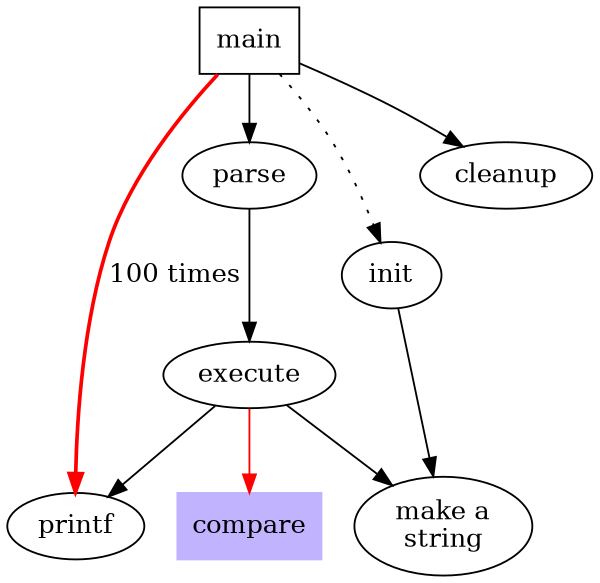
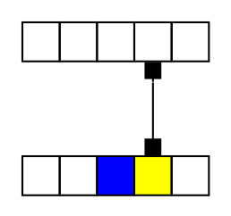

# Graphviz

Thanks to [this amazing tutorial](https://www.graphviz.org/pdf/dotguide.pdf), I learnt this very impressive tool to help us visualize things.

## Example








```html
digraph G {
  graph [splines=ortho, nodesep = 1]
  rankdir=LR
  node [shape=box, color=white]
  VRAM [style=filled, label = "VRAM (Reg Files)", fontcolor = white, fillcolor = black] 
  VGA  [style=filled, label = "VGA control", fontcolor = white, fillcolor = green] 
  AVALON [style=filled, label = "AVALON BUS", fontcolor = white, fillcolor = blue] 
  font_rom [style=filled, label = "font rom", fontcolor = white, fillcolor = "#7d3aa3"] 
  font_data [style=filled, label = "font data", fontcolor = white, fillcolor = "#7d3aa3"] 
  char [style=filled, label = "char reg", fontcolor = white, fillcolor = "#7d3aa3"] 
  VRAM -> char -> font_rom -> font_data -> VRAM
  VRAM -> AVALON [dir = both]
  VGA -> VRAM

  subgraph "cluster A"
    {   
        VRAM_structure [label = "VRAM struct \n main reg files"]
        subgraph "cluster B"
        {
                control_reg[shape=none];
        }
    }
}
```

