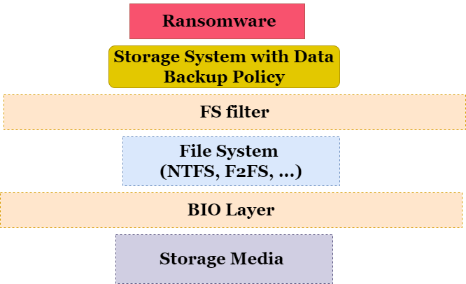
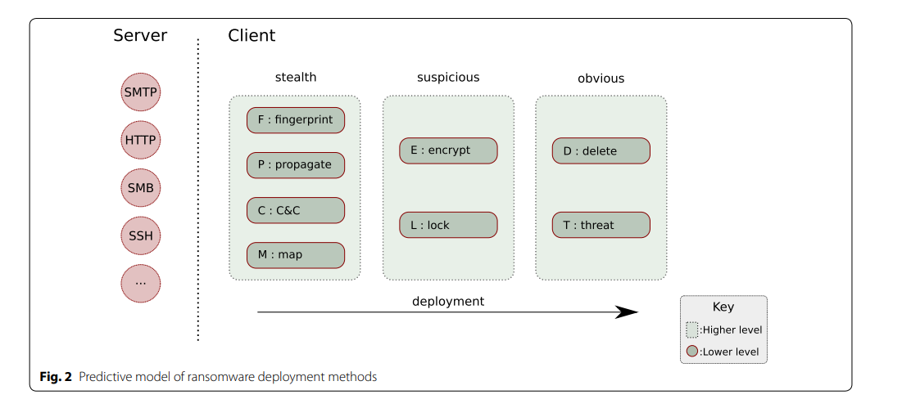

<style>
img[alt~="center"] {
  display: block;
  margin: 0 auto;
}
</style>
Slides at [slides](<../assets/slides/testing framework.pdf>)

---

# Ransome 

## Some Related Resources

[minifilter](https://learn.microsoft.com/en-us/windows-hardware/drivers/ifs/filter-manager-concepts)

[ransom analysis1](https://learn.microsoft.com/en-us/windows-hardware/drivers/ifs/filter-manager-concepts)

[unveil : protection](https://www.usenix.org/conference/usenixsecurity16/technical-sessions/presentation/kharaz)

[hardware protection](https://zhuanlan.zhihu.com/p/31129885)

[hardware protection](https://jianh.web.engr.illinois.edu/papers/flashguard-ccs17-jian.pdf)

---

## Attack Defense Paradigm

I attack your computer based on your OS source code

I protect my computer based on your attack source code

...

Never end

`Testing Frame Work` $\rightarrow$ `Statisitcs`

OK, if system A fails at 5 different virus and system B only fails at 1, who is better? You can't tell.

---

Need an index that's independent from protection method and attack method.

* Ideal defense $\rightarrow$ no ransomware anymore
* k-lag defense, let ransomware run $k\ \micro\text{s}$ and see the destruction.
  * Destruction means the unrecoverable data in mapped disk(target storage region which stores targeted files to ransomware)

Question :

How generic should this testing framework be?


---

### Generic

Generic meeans the testing framework should be  independent of variables. But what are those variables. If storage system types isn't one of these variable, then I think the way is to widely test upon GFS, XFS, mySQL, postgreSQL ...

Variable can also include the type of ransomware : 

---

#### Observation 

* Current ransomware are hard to work with because
  * server might be off-line (Many can't connect to server).
  * only available on windows, hard to probe
  * some ransomware destorys the system (ban all the system-level operation, not allowing you to probe any system-level data)

---

* With working ransomware, still
  * hard to standardize, why choose this one over other ransomwares?
  * not summable (fs lost 70% data over ransomware1, 80% data over ransomware2, another file system fs' lost 90% data over ransomware1 50% data over ransomware2), which is better? Can we take sum over any data?
  * Most of ransomwares disregard remote backups, while having access to credential manager.

---

### Standardized ransomware

* Healthy : do nothing except for encryption data
* Transparent : can be adjusted for testing framework
* Working : can encryt data without the existence of server.
* Flexible : can do batch test.

---

#### How does storage systems do their journal?

* Many of the storage systems don't do data journal, they do metadata journal only for performance.
* Some systems do coW, but that's per transaction, the amount of recoverable files are limited.

---

### Data backup

Generic way to defend against ransomware.

So need to study journal and logging behavior...

The most important problem is frequency and expiration rate of those backups, I think.

Now I think those can be omitted because index should be from "stationary" data backups and calculate their ratios.

---

### Backup Resources

[AFS backup](https://docs.openafs.org/AdminGuide/HDRWQ248.html#HDRWQ249)

[backup command](https://www.ibm.com/docs/en/aix/7.1?topic=b-backup-command)


---

### Remote backups : crisis on credential manager

The following 3 slides are from https://www.nirsoft.net/utils/credentials_file_view.html

#### Data Stored In Credentials Files

Windows operating system stores the following information inside Credentials files:
* Login passwords of remote computers on your LAN.
* Passwords of mail accounts on exchange server (stored by Microsoft Outlook)
* Windows Live session information.

--- 

* Remote Desktop 6 user\password information.
* Internet Explorer 7.x and 8.x: passwords of password-protected Web sites ("Basic Authentication" or "Digest Access Authentication")
* Password of MSN Messenger / Windows Messenger accounts

---

#### Credentials File Location

You can find the Credentials files of Windows in the following locations:
```
C:\Users\[User Profile]\AppData\Roaming\Microsoft\Credentials (Windows Vista and later)
C:\Users\[User Profile]\AppData\Local\Microsoft\Credentials (Windows Vista and later)
C:\Windows\system32\config\systemprofile\AppData\Local\Microsoft\Credentials (Windows 8 and later)
C:\Documents and Settings\[User Profile]\Application Data\Microsoft\Credentials (Windows XP)
C:\Documents and Settings\[User Profile]\Local Settings\Application Data\Microsoft\Credentials (Windows XP)
```
---

Those are no valid locations, but I duplicated `.crd` file to desktop and find the encrypted results.

And there are ways to decryt those account / password 

> CredentialsFileView is a simple tool for Windows that decrypts and displays the passwords and other data stored inside Credentials files of Windows. 

---

#### Ransomware operates at your comp. Message protection will be likely to fail.

You logged in to onedrive today, so your cached verification will bypass the text-message-verification.

Then you have a ransomware.

But in testing framework's perspective, what are we testing against? The expiration rate of cloud service?

**Are we testing subject storage system or the cloud backup sub-system?**

---

### Remote storage 

[summary](https://www.zhihu.com/question/23645117/answer/124708083) (might expire)

[GFS](https://cs.stanford.edu/~matei/courses/2015/6.S897/slides/gfs.pdf)

---

### Implementation

Need this tool to be portable, probably have to encapsulate the code and provide some APIs. However, the probes within BIOs should be enforced (not optional).

~~Ideas, now I don't think these are going to help~~:

* Patch :
  * [kernel patch1](https://netkit-jh.github.io/docs/1.0.0/dev/guides/kernelpatches/#:~:text=To%20create%20kernel%20patches%2C%20firstly,use%20the%20URL%20available%20KERNEL_URL%20.&text=Once%20you%20have%20a%20.,patches%2F%20and%20name%20it%20appropiately.)
  * [kernel patch2](https://www.kernel.org/doc/html/v4.15/process/applying-patches.html)
  * [kernel patch3](https://medium.com/coinmonks/make-linux-kernel-better-beginners-guide-to-writing-your-first-linux-patch-1125e4891e0d)
  * [kernel patch4](https://initialcommit.com/blog/git-format-patch)

---

### Windows & IO

* [Windows7 iso](https://www.softlay.com/downloads/windows-7-home-basic?download=links&opt=1)
* Windows 10 ISO should be available...


--- 


### Current obstacles

1. NTFS does NOT have data journal. Typical ransomwares don't exist on linux.

2. Don't really know how to trace journals and logs(def unable to do it in block level) in **Windows** and with storage systems that I **can't access source code**.
    * Implicit problem, layering : how to trace data backups ?  
3. Might need to build a standardized ransomware(may need to study the repos on github a little bit)

4. False positive : it happens to many Filesystem Filters based detecting tools.  

---


### Current obstacles (cont.)

4. More comments on false positive : it also suggests a software-subjected detection is worse than system-subjected detection.

5. I don't think logal backups have any meaning because backups essentially are files.

6. **If local backups failed all the time, then aren't we just testing the cloud service's security. a.k.a. how likely it can be accessed by ransomware?**

--- 


## Update : Design and New thinking (2023-05-04)

Several things mentioned in the meeting

---

* We need to target several storage systems, the only thing we need to care about is the data backups.
  * Most of the targeted systems only have one copy of data (e.g. NTFS only logs metadata)
  * So we need to simulate remote backups
    * We can be real by using [One Drive API](https://learn.microsoft.com/en-us/onedrive/developer/rest-api/concepts/permissions_reference?view=odsp-graph-online) & [video](https://www.youtube.com/watch?v=Ok8O_QnrSBI&ab_channel=JieJenn) & [Google Cloud API](https://cloud.google.com/storage-transfer/docs/apis)
    * Or we can **fake it** so that our testing framework does NOT have that many dependencies

---

* Testing framework needs to utilize **several core features of ransomwares**.
  * To do that we need to analyze the behaviors of ransomwares (existing)

* We can adjust assumptions on 
  * ransomware privilege level
  * storage backup time (meaning at those time the back-up storage is connected to OS)
  * back-up frequency (we have backup)

---

### Mini filter, our solution to NTFS  

[mini filter](https://github.com/microsoft/Windows-driver-samples/blob/main/filesys/miniFilter/minispy/README.md)
[mini filter APIs](https://www.easefilter.com/kb/fltkernel-fltcreatefile.htm)

---

### Pre-processing Scanning original Storage System

* Scan for file access

* Scan for 

---

### Solution to "Discrete" statistics

What if the backups are either all-encrypted or all-safe.

Divide into two aspectes

* Security


* Consistency

---

#### Notes on security

In data backup industry, security usually means how safe the remote server is, that is, even when malware has **external** access to the server, how safe your data is. 

[They](https://www.barracuda.com/products/data-protection/backup/features) typically do it via data encryption. 

Note that this is no longer valid to ransomware because ransomware can have the same access right as normal user

---

### Log-strcutred FS : Natural Killer of Ransomware

[f2fs](https://android.googlesource.com/kernel/common/+/22f837981514e157f8f9737b25ac6d7d90a14006/Documentation/filesystems/f2fs.txt)

* I can use GC attack to clear your logs

[linux ransomware](https://www.cynet.com/ransomware/linux-ransomware-attack-anatomy-examples-and-protection/)

---

#### More notes on GC : F2FS

>  This policy selects a victim section not only based on its utilization but also its “age”. F2FS infers the age of a section by averaging the age of segments in the section, which, in turn, can be obtained from their last modification time recorded in SIT. With the cost-benefit policy, F2FS gets another chance to separate hot and cold data.

---

### Bonus : IPLFS

https://www.usenix.org/conference/atc22/presentation/kim-juwon

& 

[How to center the image in marp](https://github.com/marp-team/marpit/issues/141)

[network cs425](https://www.cse.iitk.ac.in/users/dheeraj/cs425/index.html)
[DFS cs440](http://www.cs.cmu.edu/~dga/15-440/S14/syllabus.html)


---

### Current Structure of Our Testing Framework



---

### Ransomware Report and Key Characteristics

> and deleting the shadow copy of user fles


> According to (Kharraz et al. 2016) there are three ways ransomware encrypts fles: (i) overwriting originals iginals, and (iii) encryption and secure deletion of the originals

`rm` calls `unlink`. They have slight difference but for testing system, they are basically the same.


---

### Tracing 

[strace](https://man7.org/linux/man-pages/man1/strace.1.html)

blktrace, blkparse, btt

```
sudo apt-get install blktrace
```

---


[Report](https://crimesciencejournal.biomedcentral.com/articles/10.1186/s40163-019-0097-9)



---

### Mapping from Ransomware Set to Standardized Ransomware

[ML Rans](https://arxiv.org/pdf/1609.03020.pdf)

* Need to show ransomware can be mapped to a certain group of characteristics
* Many characteristics about ransomware are encryption related, so it's not related to target system
* So the only sets of characteristics should be :
  * 

---

### Propagate

[shared folder](https://threatpost.com/diary-of-a-ransomware-victim/117877/)

Might need to check AFS, NFS, and more sharing related storage systems to check if the webservice network is secure enough.