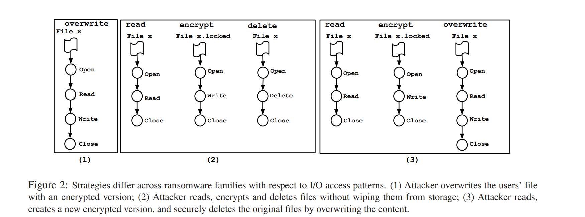
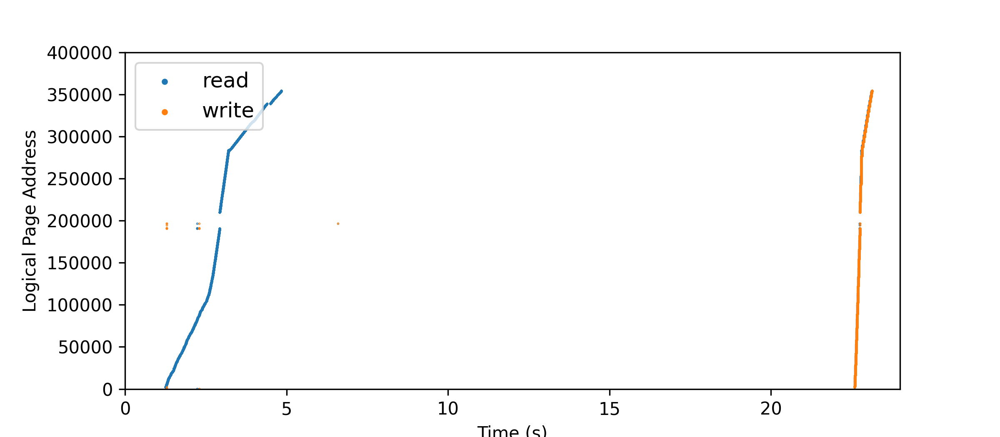
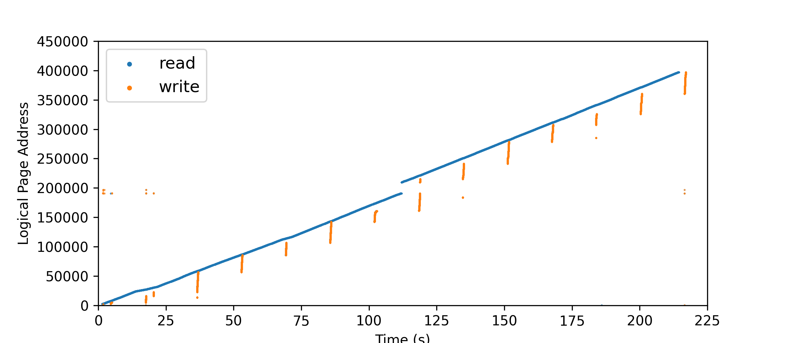
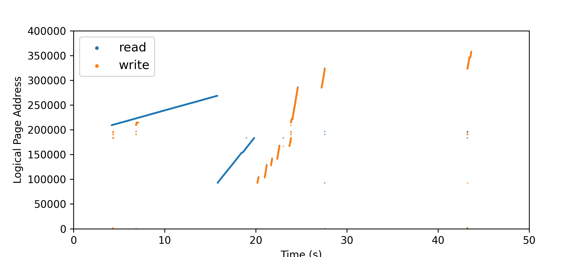
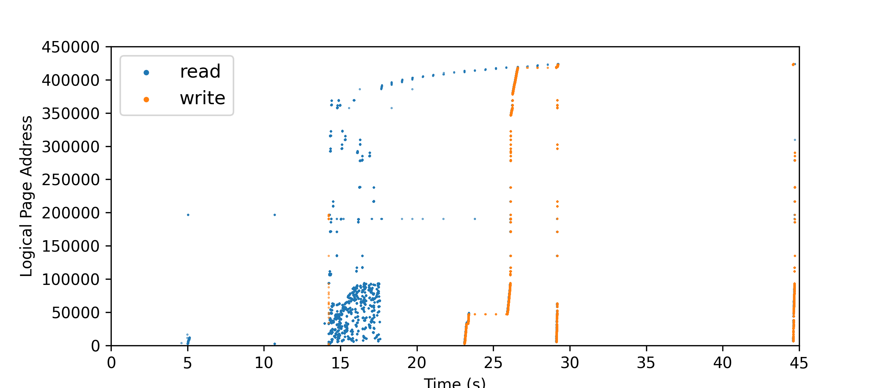

Slides are in 

[slides](../assets/slides/rans_attack_pattern.pdf)

---

# Ransomware Attack Patterns & Attacked System's File Distribution

1. Operation sequence of ransomware = $N1 = 3$ 
2. R W type of each operation       = $N2 = 2$
3. Characteristics of each R W type = $N3 = 5$
4. File System Image for each attack patttern = $N4 = 27$

\# Test cases ($N$) for each storage system :

$$
N = N1 \times N2 \times N3 \times N4 = 810
$$

---

## Assumptions

Beause we're targeting storage system, application level difference can be omitted 

- ~~Access Control(ACL)~~
- ~~Access Time~~
- ~~File content (Entropy of Files)~~

Although real-world ransomware heavily relies on these traits, they are irrelevant to our testing.

---

## Operation sequence of ransomware

3 cases :
- Read Encrypt Overwrite
- Read Encrypt Create(New) Write Delete(Original)
- Read Encrypt Create(New) Write Shred(Original)

---

Ransomware Attack types [Report](https://crimesciencejournal.biomedcentral.com/articles/10.1186/s40163-019-0097-9): 

> According to (Kharraz et al. 2016) there are three ways ransomware encrypts fles: (i) overwriting originals with the encrypted versions, (ii) encryption then unlinking of the originals, and (iii) encryption and secure deletion of the originals

Detailed Explanation [paper](https://www.usenix.org/system/files/conference/usenixsecurity16/sec16_paper_kharraz.pdf)

> An attacker can use customized destructive functions, or Windows API functions to delete the original user’s files. The attacker can also overwrite files with the encrypted version, or use secure deletion via the Windows Secure Deletion API.

---

---

## Rare Patterns of Ransomware

Besides sequence of Read / Write / Create / Unlink / Erase Operations, what other things can ransomware do?

---

### Corrupting MFT / Inode Table (Indexing)

> attack that encrypted the Master File Table (MFT) of victims, but did not unlock it after payment. Encrypting the MFT renders the content of a hard drive unusable, and is rarely used among ransomware families. 

This can be used to test the resilience of storage system.

- After partially corrupted disk, how much unencrypted data are there?

---

## R / W types obtained from our study

- RW continously (R W whole file)
- RW in chunks

---

### R W continously 

---

- Read / Write whole file

---

### Read Write chunk by chunk

---

- Read / Write Chunk by Chunk 

---

## Characteristics of each R W type 

- **Time gaps** between a certain amount of reads / writes or a certain amount of bytes read / written 
- **sequential / random** access pattern 
- **size** of chunk / minimum R W length
- \# chunks / bytes each operation issues
- **threads** used to R W
---

### Sequential / Random Access Pattern

[paper](https://www.usenix.org/system/files/login/articles/login_spring16_02_tarasov.pdf)

> First, one can specify an I/O size with the iosize attribute. Second, one can pick between sequential (default) and random accesses
- Time gaps and the threshold can be changed for a single test. (e.g.how many reads before pause / how many bytes of read before pause can be different for a single ransomware) 

---

---

### Multi-threaded R / W

---

- Multi-threaded can be turned on for a certain number of files. (Target Abibrary)
- Can be used in any of previous operation. (Operation Abitrary)
- Multi-threaded can be stopped with time gaps for a certain amount of read / write or a certain amount of bytes read / written

---

### Read / Write # files

- randomly pick k files to encrypt
- pick files with size between [l, r]

--- 

## File System Image

> The performance of file systems and related software depends on characteristics of the underlying file-system image (i.e., file-system metadata and file contents).

We use a set of FS metadata (parameters) as base, only changing 3 sets of attributes to obtain 27 sets of FS distribution.

> The snapshots of file-system metadata were collected over a five-year period representing over 60, 000 Windows PC file systems in a large corporation.

[paper](https://www.usenix.org/legacy/events/fast09/tech/full_papers/agrawal/agrawal.pdf)

---

### 3 Sets of indepedent attributes 

* FS used Image size  (10MB, 1GB, 100GB)
* File Size Distribution (Peak at : Small, Medium, Large Size files )
  * Peak at Small $\mu = 2, \chi_M = 50\ \text{MB}$
  * Peak at Medium $\mu = 9.48, \chi_M = 512\ \text{MB}$
  * Peak at Large $\mu = 15, \chi_M = 4096\ \text{MB}$

* Fragmentation Degree (score = 0, 0.5, 1)

---

#### More explanation on fragmentation score

> A layout score of 1 means all files in the file system are laid out optimally on disk (i.e., all blocks of any given file are laid out consecutively one after the other), while a layout score of 0 means that no two blocks of any file are adjacent to each other on disk