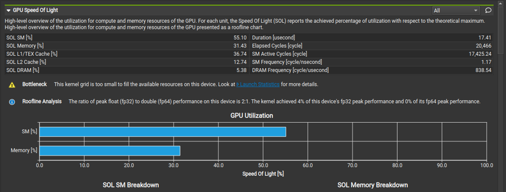
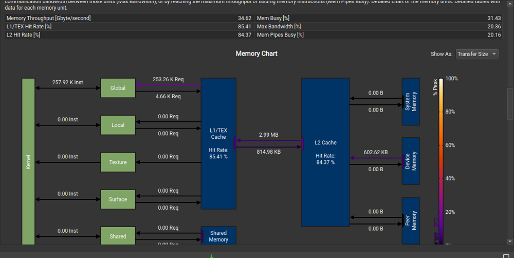

Some crazy months have passed. I got COVID, and then a new job, and then many unexpected things like these happened.

From Oct., I've been working on 4 projects, a pipeline processor, a CUDA conv kernel, 2 AI-ops related projects in Microsoft. I'm not sure if I can share the details of the Microsoft projects. 

This posts address some technical details of the CUDA conv kernel.

## The Problem

This project implements and optmizes the forward-pass of a convolutional layer using CUDA. Convolutional layers are the primary building blocks of convolutional neural networks (CNNs), which are used in many machine learning tasks like image classification, object detection, natural language processing, and recommendation systems. In general, CNNs work well on tasks where the data/input features have some level of spatial relationship.

This project involves a **modified** version of the LeNet-5 architecture shown below.


*Source: http://yann.lecun.com/exdb/publis/pdf/lecun-01a.pdf*

The optimized CUDA implementation of the convolutional layer will be used to perform inference for layers C1 and C3 (shown in red) in the figure above. We will be leveraging the [mini-dnn-cpp](https://github.com/iamhankai/mini-dnn-cpp) (Mini-DNN) framework for implementing the modified LeNet-5. 

We will be using the [Fashion MNIST dataset](https://github.com/zalandoresearch/fashion-mnist), where the inputs to the network will be a batch of 10,000 single channel images, each with dimensions of 86 x 86 pixels. The output layer consists of 10 nodes, where each node represents the likelihood of the input belonging to one of the 10 classes (T-shirt, dress, sneaker, boot etc.)

The overall learning objectives for this project are:
* Demonstrating command of CUDA and optimization approaches by designing and implementing an optimized neural-network convolutional layer forward pass
* Obtaining practical experience in analyzing and fine tuning CUDA kernels through the use of profiling tools like Nsight Systems (`nsys`) and Nsight-Compute (`nv-nsight-cu`)

## Repos

The link to the [repos](https://github.com/MooMooHorse/conv_kernel). 


## Optimizations

* Shared memory matrix multiplication and input matrix unrolling
* Kernel fusion for unrolling and matrix-multiplication (requires previous optimization)
* Tuning with restrict and loop unrolling (considered as one optimization only if you do both) 
* Sweeping various parameters to find best values (block sizes, amount of thread coarsening)
* Multiple kernel implementations for different layer sizes 
* FP16 arithmetic. (note this can modify model accuracy slightly) 

### Before Baseline : CPU convolution

```c++

void conv_forward_cpu(float *output, const float *input, const float *mask, const int B, const int M,
					  const int C, const int H, const int W, const int K, const int S)
{
	const int H_out = (H - K) / S + 1;
	const int W_out = (W - K) / S + 1;

#define out_4d(i3, i2, i1, i0) output[(i3) * (M * H_out * W_out) + (i2) * (H_out * W_out) + (i1) * (W_out) + i0]
#define in_4d(i3, i2, i1, i0) input[(i3) * (C * H * W) + (i2) * (H * W) + (i1) * (W) + i0]
#define mask_4d(i3, i2, i1, i0) mask[(i3) * (C * K * K) + (i2) * (K * K) + (i1) * (K) + i0]


	for (int b = 0; b < B; b++) 
		for (int m = 0; m < M; m++) 
			for (int h = 0; h < H_out; h++) 
				for (int w = 0; w < W_out; w++) {
					out_4d(b, m, h, w) = 0;
					for (int c = 0; c < C; c++) 
						for (int p = 0; p < K; p++) 
							for (int q = 0; q < K; q++) 
								out_4d(b, m, h, w) += in_4d(b, c, h * S + p, w * S + q) * mask_4d(m, c, p, q);
                    
                }

#undef out_4d
#undef in_4d
#undef mask_4d
}
```

This basically shows what we're trying to accomplish via this kernel, and it will be further improved to a parallel executing version in CUDA in the next section.

### Baseline : Raw CUDA kernel for convolution 

The baseline is really straightforward and is simply breaks the CPU conv kernel to parallel computing.

```c++

/**
 *  const int H_out = (H - K)/S + 1;
 *  const int W_out = (W - K)/S + 1;
    dim3 dimGrid(ceil(W_out/float(BLOCK_SIZE)), ceil(H_out/float(BLOCK_SIZE)), M * B);
 *  dim3 dimBlock(BLOCK_SIZE, BLOCK_SIZE, 1);
 * It means for each image and each feature map, we have a grid of blocks. since we have strides, 
 * we divide works after strides into different blocks.
*/
__global__ void conv_forward_kernel(float *output, const float *input, const float *mask, 
    const int B, const int M, const int C, const int H, const int W, const int K,const int S) {
    /*
    Function paramter definitions:
    output - output
    input - input
    mask - convolution kernel
    B - batch_size (number of images in x)
    M - number of output feature maps
    C - number of input feature maps
    H - input height dimension
    W - input width dimension
    K - kernel height and width (K x K)
    S - stride step length
    */

    const int H_out = (H - K)/S + 1;
    const int W_out = (W - K)/S + 1;

    #define out_4d(i3, i2, i1, i0) output[(i3) * (M * H_out * W_out) + (i2) * (H_out * W_out) + (i1) * (W_out) + i0]
    #define in_4d(i3, i2, i1, i0) input[(i3) * (C * H * W) + (i2) * (H * W) + (i1) * (W) + i0]
    #define mask_4d(i3, i2, i1, i0) mask[(i3) * (C * K * K) + (i2) * (K * K) + (i1) * (K) + i0]

    // pick a way to divide work for image and feature map
    int b = blockIdx.x % B;
    int m = blockIdx.y % M;

    int bx = blockIdx.x / B;
    int by = blockIdx.y / M;

    int w = bx * blockDim.x + threadIdx.x;
    int h = by * blockDim.y + threadIdx.y;

    // load to shared memory will be useless if stride size is big.
    // so we directly use global memory

    float sum = 0.0f;

    for (int c = 0; c < C; c++) {
        for (int p = 0; p < K; p++) {
            for (int q = 0; q < K; q++) {
                if (h * S + p < H && w * S + q < W) {
                    sum += in_4d(b, c, h * S + p, w * S + q) * mask_4d(m, c, p, q);
                }
            }
        }
    }

    if(h < H_out && w < W_out)
        out_4d(b, m, h, w) = sum;


    #undef out_4d
    #undef in_4d
    #undef mask_4d
}
```

The GPU accelerated version breaks some outer loop to allow some parallel execution.

| Batch Size | Op Time 1     | Op Time 2    | Total Execution Time | Accuracy |
| ---------- | ------------- | ------------ | -------------------- | -------- |
| 100        | *0.246515 ms* | *0.83401 ms* | *0m1.542s*           | *0.86*   |
| 1000       | *2.24226 ms*  | *15.3607 ms* | *0m10.669s*          | *0.886*  |
| 5000       | *11.5922 ms*  | *40.737 ms*  | *0m0.740s*           | *0.871*  |

From Nsight Compute, we can draw the following conclusions:

* Memory is under utilized





### Optimization 1 : `IMPL_INPUT_UNROLLING` Shared memory matrix multiplication and input matrix unrolling

*The current access pattern and technique is **convolution** which isn’t optimized and doesn’t have special hardware support. To further optimize the performance, we can first convert the whole computing pattern to matrix multiplication, hence a conv2mul kernel is needed to unroll the input matrix.* 

*The expected improvement might not be that much (or degrades the performance), but it leaves room for off-load the workload to tensor core.* 

*The optimization works by changing the computing method from convolution to matrix multiplication. I don’t think it will improve the performance at this point since the unrolling can be expensive at this point and memory coalescing also happens in baseline when set properly.* 

| Batch Size | Op Time 1    | Op Time 2     | Total Execution Time | Accuracy |
| ---------- | ------------ | ------------- | -------------------- | -------- |
| 100        | *1.45413 ms* | *0.939222 ms* | *0m0.297s*           | *0.86*   |
| 1000       | *14.3275 ms* | *9.03383 ms*  | *0m1.064s*           | *0.886*  |
| 5000       | *71.0609 ms* | *44.6977 ms*  | *0m3.832s*           | *0.871*  |

Notes : OP TIME 1 is the CUDA kernel calling time of first layer of CNN and the OP TIME 2 is for the second layer of CNN. Total exec time is for sys time under nsys.

### Optimization 2 : `IMPL_UNROLLING_KERNEL_FUSION` Kernel fusion for unrolling and matrix-multiplication

*I use kernel fusion for the original CPU unrolling to kernel input unrolling and I optimized the original matrix multiplication.* *The optimization works by running input unrolling and finding a better way to do kernel multiplication. I think this will improve the op time as well as the exec time as the work was done in CPU in the previous optimization now it’s done in GPU, and I tried the way with better memory coalescing. This optimization is built on previous optimization which gives a baseline of input unroll version implementation. In this optimization, the performance should be significantly improved.* 

```c++

__global__ void conv_forward_kernel(float *output, const float *input, const float *mask, 
    const int B, const int M, const int C, const int H, const int W, const int K,const int S) {

    const int H_out = (H - K)/S + 1;
    const int W_out = (W - K)/S + 1;

    int numARows = H_out * W_out * B;
    int numAColumns = C * K * K;
    int numBRows = C * K * K;
    int numBColumns = M;
    // int numCRows = numARows;
    // int numCColumns = numBColumns;

    #define out_4d(i3, i2, i1, i0) output[(i3) * (M * H_out * W_out) + (i2) * (H_out * W_out) + (i1) * (W_out) + i0]


	int bx = blockIdx.x; int by = blockIdx.y ; int bz = blockIdx.z;
	int tx = threadIdx.x; int ty = threadIdx.y; int tz = threadIdx.z;

	int Row = bx * BLOCK_SIZE + tx;
	int Col = by * BLOCK_SIZE + ty;

	int b = (bx * BLOCK_SIZE + tx) / (H_out * W_out);
    int m = Col;
    int h = ((bx * BLOCK_SIZE + tx) % (W_out * H_out)) / W_out;
    int w = ((bx * BLOCK_SIZE + tx) % (W_out * H_out)) % W_out;

    
    // without using shared memory
    if( Row < numARows && Col < numBColumns) {

        float Pvalue = 0;
        for(int k = 0; k < numAColumns; k++) {
            const float* AA = input;
            const float* BB = mask;
            Pvalue += AA[Row * numAColumns + k] * BB[k * numBColumns + Col];
        }
        out_4d(b, m , h, w) = Pvalue;

    }
    #undef out_4d
}

__global__ void im2col_kernel(float* output, const float *input, float* mask_o, const float* mask_i,
                    const int B, const int M, const int C, const int H, 
                    const int W, const int K,const int S) {
    
    #define in_4d(i3, i2, i1, i0) input[(i3) * (C * H * W) + (i2) * (H * W) + (i1) * (W) + i0]
    #define out_6d(i5, i4, i3, i2, i1, i0) output[ \
        (i5) * C * K * K * ((H - K)/S + 1)*((W - K)/S + 1) + \
        (i4) * (C * K * K *((W - K)/S + 1)) + \
        (i3) * (C * K * K ) + \
        (i2) * K * K + \
        (i1) * K + \
        (i0) \
    ]
    #define old_mask_4d(i3, i2, i1, i0) mask_i[(i3) * (C * K * K) + (i2) * (K * K) + (i1) * (K) + i0]
    #define mask_4d(i3, i2, i1, i0) mask_o[(i3) * (K * K * M) + (i2) * (K * M) + (i1) * (M) + i0]

    int bx = blockIdx.x; int by = blockIdx.y ; 
    int tx = threadIdx.x; int ty = threadIdx.y; 

    const int H_out = (H - K)/S + 1;
    const int W_out = (W - K)/S + 1;

    int b = (bx * BLOCK_SIZE + tx) / (H_out * W_out);
    int h = ((bx * BLOCK_SIZE + tx) % (W_out * H_out)) / W_out;
    int w = ((bx * BLOCK_SIZE + tx) % (W_out * H_out)) % W_out;

    int m = (by * BLOCK_SIZE + ty) / (K * K * C);
    int c = ((by * BLOCK_SIZE + ty) % (K * K * C)) / (K * K);
    int p = ((by * BLOCK_SIZE + ty) % (K * K * C)) % (K * K) / K;
    int q = ((by * BLOCK_SIZE + ty) % (K * K * C)) % (K * K) % K;

    if (b < B && h < H_out && w < W_out && c < C && p < K && q < K && h * S + p < H && w * S + q < W) 
        out_6d(b, h, w, c, p, q) = in_4d(b, c, h * S + p, w * S + q);

    if (m < M && c < C && p < K && q < K)
        mask_4d(c, p, q, m) = old_mask_4d(m, c, p, q);

    #undef out_6d
    #undef in_4d
    #undef mask_4d
    #undef old_mask_4d
}
```


| Batch Size | Op Time 1     | Op Time 2    | Total Execution Time | Accuracy |
| ---------- | ------------- | ------------ | -------------------- | -------- |
| 100        | *0.234637 ms* | *1.08158 ms* | *0m0.181s*           | *0.86*   |
| 1000       | *2.24452 ms*  | *10.7243 ms* | *0m0.332s*           | *0.886*  |
| 5000       | *11.0265 ms*  | *53.3184 ms* | *0m0.925s*           | *0.871*  |

### Optimization 3 : `IMPL_LOOP_UNROLL`  Tuning with restrict and loop unrolling

*I added __restrict__ keyword to pointer and I also enumerate several cases of K (K=1,2,3,4,7) for unrolling purpose. The restrict pointer can help compiler improve the performance, and the unrolling can significantly improve the baseline approach by improving memory coalescing ability and helping compiler and reduce the use of extra registers which would cause many overheads.* *The restrict pointer can help compiler improve the performance by informing the compiler that this memory region is exclusive to this pointer and will not be referenced by other pointer in this kernel, allowing it to make optimization if available, and the unrolling can significantly improve the baseline approach by improving memory coalescing ability and helping compiler and reduce the use of extra registers which would cause many overheads. This would definitely improve the performance for forward convolution for previously stated reasons. This optimization is independent from previous 2 optimizations and should be compared with baseline implementation.* 

| Batch Size | Op Time 1     | Op Time 2     | Total Execution Time | Accuracy |
| ---------- | ------------- | ------------- | -------------------- | -------- |
| 100        | *0.197214 ms* | *0.540495 ms* | *0m0.173s*           | *0.86*   |
| 1000       | *1.89108 ms*  | *5.41518 ms*  | *0m0.344s*           | *0.886*  |
| 5000       | *10.1522 ms*  | *26.9867 ms*  | *0m1.024s*           | *0.871*  |

### Optimization 4 : `IMPL_FP16`  FP16 arithmetic

*FP16 arithmetic with restrict and loop unrolling because this set of optimizations should be most promising since all the operations can operate on 16bit width operands which will significantly reduce overhead. Although it’s note-worthy that the conversion of input and mask and output can introduce overhead.* *It works by transforming input matrix and mask matrix to FP16 accuracy. I think it will reduce the overhead of arithmetic calculation and reduce the memory throughput. This optimization is built from the loop unrolling optimization and is expected to reach the best performance.* 

```c++
__global__ void float_to_half(half *output, const float *input, const int size) {
    int i = blockIdx.x * blockDim.x + threadIdx.x;
    int j = blockIdx.y * blockDim.y + threadIdx.y;
    int x = i * blockDim.y * gridDim.y + j;
    if(x < size)
        output[x] = __float2half(input[x]);
}
```


| Batch Size | Op Time 1     | Op Time 2     | Total Execution Time | Accuracy |
| ---------- | ------------- | ------------- | -------------------- | -------- |
| 100        | *0.238143 ms* | *0.519883 ms* | *0m0.228s*           | *0.86*   |
| 1000       | *2.22948 ms*  | *5.2218 ms*   | *0m0.316s*           | *0.887*  |
| 5000       | *10.6534 ms*  | *25.0527 ms*  | *0m0.904s*           | *0.8712* |
